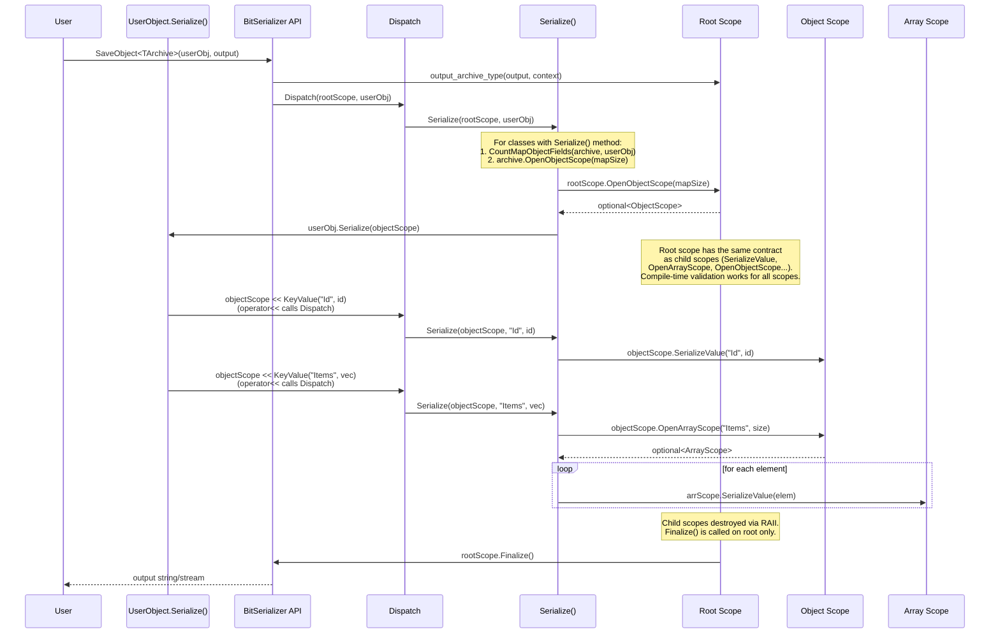

# Contributing to BitSerializer

Thank you for your interest in contributing to BitSerializer! This guide will help you set up the development environment and understand the project workflow.

## How to Contribute

We welcome contributions of all kinds:

- **Bug fixes** — found something broken? A PR with a fix is always appreciated.
- **Minor improvements** — performance tweaks, code cleanup, better error messages, small enhancements.
- **Documentation** — typo fixes, improved examples, missing explanations — all valuable.
- **Tests** — additional test coverage, edge case tests, regression tests for reported issues.
- **Performance improvements** — optimizations are welcome, but please include benchmark results before and after your changes (see [Performance Benchmarks](#performance-benchmarks)).

> [!NOTE]
> For **significant changes** — new features, architectural refactoring, changes to the public API — please start by creating an **ADR (Architecture Decision Record)** as a GitHub issue or discussion before submitting a PR. This helps us align on the approach before you invest time in implementation.

### Architecture Decision Records (ADR)

An ADR documents a significant architectural decision and its context. When proposing a major change, include the following:

- **Title** — short descriptive name for the decision (e.g., "Switch from DOM to SAX parser for JSON archive")
- **Context** — what problem or requirement motivates this change? What constraints exist?
- **Decision** — what approach are you proposing? Describe it clearly.
- **Alternatives considered** — what other approaches were evaluated, and why were they rejected?
- **Consequences** — what are the trade-offs? What becomes easier or harder? Are there breaking changes?

ADRs don't need to be formal or lengthy — a clear, concise explanation is enough. The goal is to have a shared understanding before diving into implementation.

### On adding new archive formats

The library aims to support the most widely used serialization formats, not every format that exists. Each new archive adds maintenance burden, and the author's capacity is limited. If you'd like to propose a new format, please open a discussion first — explain the use case, the format's popularity and adoption, and why existing archives don't cover the need.

## Prerequisites

### All platforms

- **C++17 compiler** (or newer)
- **CMake** >= 3.10
- **Ninja** build system
- **VCPKG** package manager

### Windows

- **Visual Studio 2022** (Community, Professional, or Enterprise)
  - Install the "Desktop development with C++" workload
  - This includes MSVC, CMake, and Ninja
  - Optionally, install the **C++ Clang Compiler for Windows** component for Clang-cl support
  - Install the **Test Adapter for Google Test** extension (by Microsoft) — enables running GTest tests directly from the VS Test Explorer

### Linux / macOS

- **Linux:** GCC (8+) or Clang (8+)
- **macOS:** Xcode Command Line Tools (provides Clang)
- Install Ninja:
  ```bash
  # Linux (Debian/Ubuntu)
  sudo apt-get install build-essential ninja-build cmake

  # macOS
  brew install ninja cmake
  ```

---

## Setting up VCPKG

VCPKG manages third-party dependencies (RapidJSON, PugiXml, RapidYAML, Google Test).

### Install VCPKG

```bash
# Clone vcpkg (anywhere on your system)
git clone https://github.com/microsoft/vcpkg.git
cd vcpkg

# Bootstrap
# Windows:
.\bootstrap-vcpkg.bat
# Linux/macOS:
./bootstrap-vcpkg.sh
```

### Set environment variable

Set `VCPKG_ROOT` to point to your vcpkg installation:

**Windows (PowerShell):**
```powershell
[System.Environment]::SetEnvironmentVariable("VCPKG_ROOT", "C:\path\to\vcpkg", "User")
```
> [!TIP]
> This sets the variable permanently (stored in the registry). Restart your terminal or IDE for the change to take effect in already running processes.

**Linux/macOS:**
```bash
# Add to ~/.bashrc or ~/.zshrc:
export VCPKG_ROOT=/path/to/vcpkg
```

---

## Building the project

### Option 1: Visual Studio (recommended for Windows)

The easiest way on Windows is to use Visual Studio's built-in CMake support:

1. Open Visual Studio 2022
2. Select **File > Open > Folder...** and choose the BitSerializer repository root
3. Visual Studio will automatically detect `CMakeSettings.json` and configure the project
4. Select a configuration from the dropdown (e.g., `Win-MSVC-x64-Debug`)
5. Build with **F7** (or **Ctrl+Shift+B**, or **Build > Build All**)
6. Run tests with **Test > Run All Tests**

> [!TIP]
> VS stores build output in `%LOCALAPPDATA%\CMakeBuilds\<GUID>\build\<Config>\` (not in the repository). When running tests or binaries from the command line, use the path shown in the VS Output window, or build from the command line instead (see Options 2/3 below) to get the standard `build/` directory.

Available configurations in `CMakeSettings.json`:

| Configuration | Compiler | Platform | C++ Std | Linkage |
|---|---|---|---|---|
| `Win-MSVC-x86-Debug/Release` | MSVC | x86 | 17 | static |
| `Win-MSVC-x64-Debug/Release` | MSVC | x64 | 17 | static |
| `Win-MSVC-x64-Debug+Analysis` | MSVC | x64 | 17 | static + clang-tidy |
| `Win-MSVC-x64-Debug-Dynamic` | MSVC | x64 | 17 | shared |
| `Win-MSVC-x64-CXX20-Debug/Release` | MSVC | x64 | 20 | static |
| `Win-MSVC-x64-CXX23-Debug/Release` | MSVC | x64 | 23 | static |
| `Win-Clang-x64-Debug/Release` | Clang-cl | x64 | 17 | static |
| `Linux-GCC8-x64-Debug/Release` | GCC 8 | x64 | 17 | static |
| `Linux-GCC12-x64-CXX20-Debug/Release` | GCC 12 | x64 | 20 | static |
| `Linux-Clang8-x64-Debug/Release` | Clang 8 | x64 | 17 | static |
| `Linux-Clang14-x64-CXX20-Debug/Release` | Clang 14 | x64 | 20 | static |
| `Linux-GCC-ARM32-Debug/Release` | GCC (cross) | ARM32 | 17 | static |
| `Linux-GCC-ARM64-CXX20-Debug/Release` | GCC (cross) | ARM64 | 20 | static |
| `Linux-GCC-ARM64BE-Debug/Release` | GCC (cross) | ARM64BE | 17 | static |

> [!NOTE]
> Linux and ARM configurations require a remote machine connected via SSH. This can be a VM in VirtualBox, WSL, or any Linux machine accessible from your Windows host. Configure the remote connection in **Tools > Options > Cross Platform > Connection Manager** in Visual Studio.
>
> See also: [Linux development with C++ in Visual Studio](https://learn.microsoft.com/en-us/cpp/linux/?view=msvc-170) — setup guide, remote connection, and CMake Linux projects.

> [!NOTE]
> The project uses `CMakeSettings.json` rather than `CMakePresets.json`. This is intentional — CMake Presets require CMake 3.19+, but the project supports GCC 8 and Clang 8, which ship with older CMake versions (3.10–3.16).

> [!TIP]
> If VS doesn't pick up `CMakeSettings.json` when opening the project, check that **Tools > Options > CMake > General > Always use CMake Presets** is **disabled**. When enabled, VS ignores `CMakeSettings.json` and may auto-create a default `CMakePresets.json`.

### Option 2: Command line (Windows)

Use the **pre-configured VS developer environment** — open one of these from the Start Menu:

```
Visual Studio 2022 > Visual Studio Tools > VC >
    x64 Native Tools Command Prompt for VS 2022    (build for x64)
    x64_x86 Cross Tools Command Prompt for VS 2022 (build for x86 from x64 host)
```

These prompts have MSVC, CMake, and Ninja already in PATH. Then:

```cmd
cd <path-to-bitserializer>

:: CMake configure
cmake -GNinja -B build -DCMAKE_BUILD_TYPE=Release ^
    -DBUILD_TESTS=ON -DBUILD_SAMPLES=ON -DBUILD_BENCHMARKS=ON ^
    -DBUILD_JSON_ARCHIVE=ON -DBUILD_CSV_ARCHIVE=ON -DBUILD_MSGPACK_ARCHIVE=ON ^
    -DBUILD_RAPIDJSON_ARCHIVE=ON -DBUILD_PUGIXML_ARCHIVE=ON -DBUILD_RAPIDYAML_ARCHIVE=ON

:: Build
ninja -C build

:: Run tests
ctest --test-dir build -T test --output-on-failure -j2
```

**Using Clang-cl instead of MSVC:**

From the same VS developer command prompt, add `-DCMAKE_C_COMPILER=clang-cl -DCMAKE_CXX_COMPILER=clang-cl` to the CMake command:

```cmd
cmake -GNinja -B build -DCMAKE_BUILD_TYPE=Release ^
    -DCMAKE_C_COMPILER=clang-cl -DCMAKE_CXX_COMPILER=clang-cl ^
    -DBUILD_TESTS=ON -DBUILD_SAMPLES=ON -DBUILD_BENCHMARKS=ON ^
    -DBUILD_JSON_ARCHIVE=ON -DBUILD_CSV_ARCHIVE=ON -DBUILD_MSGPACK_ARCHIVE=ON ^
    -DBUILD_RAPIDJSON_ARCHIVE=ON -DBUILD_PUGIXML_ARCHIVE=ON -DBUILD_RAPIDYAML_ARCHIVE=ON
```

### Option 3: Command line (Linux / macOS)

```bash
cd <path-to-bitserializer>

# Configure
cmake -GNinja -B build -DCMAKE_BUILD_TYPE=Release \
    -DBUILD_TESTS=ON -DBUILD_SAMPLES=ON -DBUILD_BENCHMARKS=ON \
    -DBUILD_JSON_ARCHIVE=ON -DBUILD_CSV_ARCHIVE=ON -DBUILD_MSGPACK_ARCHIVE=ON \
    -DBUILD_RAPIDJSON_ARCHIVE=ON -DBUILD_PUGIXML_ARCHIVE=ON -DBUILD_RAPIDYAML_ARCHIVE=ON

# Build
ninja -C build

# Run tests
ctest --test-dir build -T test --output-on-failure -j2
```

**Using a specific compiler:**

```bash
# GCC 14
cmake -GNinja -B build -DCMAKE_BUILD_TYPE=Release \
    -DCMAKE_C_COMPILER=gcc-14 -DCMAKE_CXX_COMPILER=g++-14 \
    ...

# Clang 15
cmake -GNinja -B build -DCMAKE_BUILD_TYPE=Release \
    -DCMAKE_C_COMPILER=clang-15 -DCMAKE_CXX_COMPILER=clang++-15 \
    ...
```

### Static analysis (clang-tidy)

Add `-DSTATIC_ANALYSIS_CLANG_TIDY=ON` to any CMake configure command (Windows, Linux, or macOS) to run clang-tidy during the build:

```bash
cmake -GNinja -B build -DCMAKE_BUILD_TYPE=Debug \
    -DSTATIC_ANALYSIS_CLANG_TIDY=ON \
    -DBUILD_TESTS=ON -DBUILD_JSON_ARCHIVE=ON \
    -DBUILD_CSV_ARCHIVE=ON -DBUILD_MSGPACK_ARCHIVE=ON
ninja -C build
```

---

## CMake Options Reference

> [!IMPORTANT]
> All archive options are **OFF by default** — you must explicitly enable what you need.

| Option | Default | Description |
|--------|---------|-------------|
| `BUILD_TESTS` | OFF | Build test executables |
| `BUILD_SAMPLES` | OFF | Build sample projects |
| `BUILD_BENCHMARKS` | OFF | Build performance benchmarks |
| `BUILD_JSON_ARCHIVE` | OFF | Built-in JSON archive (no external dependency) |
| `BUILD_CSV_ARCHIVE` | OFF | Built-in CSV archive (no external dependency) |
| `BUILD_MSGPACK_ARCHIVE` | OFF | Built-in MsgPack archive (no external dependency) |
| `BUILD_RAPIDJSON_ARCHIVE` | OFF | JSON archive via RapidJSON |
| `BUILD_PUGIXML_ARCHIVE` | OFF | XML archive via PugiXml |
| `BUILD_RAPIDYAML_ARCHIVE` | OFF | YAML archive via RapidYAML |
| `BUILD_SHARED_LIBS` | OFF | Build as shared/DLL library |
| `STATIC_ANALYSIS_CLANG_TIDY` | OFF | Enable clang-tidy during build |
| `CMAKE_CXX_STANDARD` | 17 | C++ standard (17, 20, or 23) |

---

## Performance Benchmarks

If your changes may affect performance (serialization speed or output size), please verify that there is no significant regression by running the benchmarks.

### Running benchmarks

Build the benchmark executable in Release mode (benchmarks in Debug mode use minimal test time — only enough to verify functionality):

```cmd
:: Windows (from VS Developer Command Prompt)
cmake -GNinja -B build -DCMAKE_BUILD_TYPE=Release -DBUILD_BENCHMARKS=ON ...
ninja -C build archives_benchmarks

:: Run (from command-line build)
build/bin/archives_benchmarks.exe
```

In Release mode, each archive and stage runs for **30 seconds** to produce repeatable results. The benchmark also warms up the CPU for 10 seconds before starting.

> [!IMPORTANT]
> Avoid using the system during the test for accurate results. Close other applications and background processes that may cause fluctuations.

### Benchmark details

- Pins the process to a single CPU core and sets maximum priority to minimize fluctuations
- Compares BitSerializer archives against raw usage of underlying libraries (RapidJSON, PugiXml, RapidYAML, nlohmann-json)
- Measures serialization speed (fields/ms) for save and load operations
- Reports are saved as JSON files in `benchmark_results/` directory (requires RapidJSON archive to be enabled)

---

## Project Structure

Key directories:
- `include/bitserializer/` — public API headers
- `src/` — implementations for built-in archives (CSV, JSON, MsgPack)
- `tests/unit_tests/` — per-module unit tests
- `tests/integration_tests/` — per-archive end-to-end tests
- `samples/` — 15 example projects
- `docs/` — per-format documentation

## Architecture Overview

The library uses an **archive pattern**: each format provides `input_archive_type` (deserialization) and `output_archive_type` (serialization). `BitSerializer::LoadObject<TArchive>()` / `SaveObject<TArchive>()` dispatch values through `Detail::Dispatch()`, which routes fundamentals, STD containers, KeyValue pairs, and custom classes to the correct `Serialize()` overload.

The code example below serializes a `User` object — the diagram that follows visualizes the same flow step by step:

```cpp
struct User
{
    int Id = 0;
    std::string Name;
    std::vector<std::string> Tags;

    template <class TArchive>
    void Serialize(TArchive& archive)
    {
        archive << KeyValue("Id", Id);
        archive << KeyValue("Name", Name);
        archive << KeyValue("Tags", Tags);
    }
};

// Usage:
std::string output;
BitSerializer::SaveObject<JsonArchive>(user, output);
```



### Archive scope contract

A **scope** is a short-lived RAII object responsible for serializing the current node (object, array, or binary blob) in the archive. It does not own child scopes — each nested node creates its own scope, and when all nested elements are serialized, the parent scope's destructor finalizes the node. Root, object, and array scopes each implement the same core interface. Scopes inherit from both the archive traits and `TArchiveScope<SerializeMode>`, which provides `GetMode()`, `IsSaving()`, `IsLoading()`, `GetContext()`, and `GetOptions()`.

| Method | Scope types | Mode | Description |
|--------|------------|------|-------------|
| `GetPath()` | All | Both | Current path in archive (for error messages) |
| `SerializeValue(T& value)` | Root, Array, Binary | Both | Serialize next value |
| `SerializeValue(TKey&& key, T& value)` | Object | Both | Serialize value by key |
| `OpenArrayScope(...)` | Root, Array, Object | Both | Open nested array |
| `OpenObjectScope(...)` | Root, Array, Object | Both | Open nested object |
| `OpenBinaryScope(...)` | Root, Array, Object | Both | Open nested binary (if supported) |
| `Finalize()` | Root only | Both | Called after serialization completes |
| `GetEstimatedSize()` | Array, Object, Binary | Load | Element count for container reserve |
| `IsEnd()` | Array, Binary | Load | `true` when all elements read |
| `VisitKeys(TCallback&&)` | Object | Load | Enumerates all keys (re-seeks to start) |

All scopes, including root, implement the same contract — the combination of methods (`SerializeValue`, `OpenArrayScope`, `OpenObjectScope`) which enables **compile-time format validation**. For example, CSV root only has `OpenArrayScope()` (no `SerializeValue()`), so serializing a primitive at root level is a compile error. See `serialization_detail/serialization_dispatch.h` and the respective archive headers for details.

### Archive type alias

The top-level archive (e.g., `MsgPackArchive`) is a type alias that specializes `TArchiveBase` with the archive's traits and root scope classes:

```cpp
using MsgPackArchive = TArchiveBase<
    Detail::MsgPackArchiveTraits,
    Detail::MsgPackReadRootScope,
    Detail::MsgPackWriteRootScope
>;
```

`TArchiveBase` inherits the traits struct and provides:
- Traits constants (`archive_type`, `key_type`, `is_binary`, `require_array_size`, etc.)
- `input_archive_type` — root scope class for deserialization
- `output_archive_type` — root scope class for serialization

---

## Coding Style

When in doubt, follow the patterns you see in the surrounding code.

### Language and tooling

- **C++17** minimum standard
- **Clang-tidy** is configured (`.clang-tidy`) with all warnings treated as errors
- **Tabs** for indentation
- `#pragma once` for include guards

### Naming conventions

| Element | Convention | Examples |
|---------|-----------|----------|
| Classes / Structs | CamelCase | `SerializationOptions`, `CValueMeta` |
| Interfaces | `I` + CamelCase | `IJsonReader`, `ICsvReader` |
| Public/protected methods | CamelCase | `ReadValue()`, `OpenArray()`, `GetPosition()` |
| Private methods | CamelCase | `ParseNextLine()`, `UnescapeValue()` |
| Private member variables | `m` + CamelCase | `mPos`, `mLineNumber`, `mInputData` |
| Local variables / Constants | camelCase | `codepoint`, `hexVal`, `targetValue` |
| Template parameters | `T` + CamelCase | `TSource`, `TTarget`, `TArchive` |
| Type aliases (public, in traits/classes) | `snake_case_type` | `value_type`, `key_type`, `input_archive_type` |
| Type aliases (internal) | `snake_case` | `archive_string_view`, `msgpack_variable_key` |
| Macros | `BITSERIALIZER_` + `SCREAMING_SNAKE_CASE` | `BITSERIALIZER_HAS_FILESYSTEM`, `BITSERIALIZER_REGISTER_ENUM` |
| Namespaces | CamelCase | `BitSerializer::Json::Detail` |

> [!NOTE]
> Some existing classes use a `C` prefix (e.g., `CJsonStringReader`) — this is a legacy convention. New code should use plain CamelCase without the prefix.

### Braces and formatting

- **Always use braces** for `if`/`else`/`for`/`while` blocks
- Opening brace on a separate line:
  ```cpp
  if (ch == 'n' && mInputData.compare(mPos + 1, 3, "ull", 3) == 0)
  {
      mPos += 4;
      return true;
  }
  ```
- For single-statement blocks, it is acceptable to put the opening brace on the same line:
  ```cpp
  if (hexVal == 0xFF) {
      throw ParsingException("Invalid hex digit", lineNumber, pos);
  }
  ```
- `else` on its own line:
  ```cpp
  if (codepoint < 0x80)
  {
      buffer += static_cast<char>(codepoint);
  }
  else if (codepoint < 0x800)
  {
      buffer += static_cast<char>(0xC0 | (codepoint >> 6));
  }
  ```

### Documentation and headers

- **Doxygen-style** comments in English for public API: `/** @brief ... */`
- **MIT license header** required on all source files:
  ```cpp
  /*******************************************************************************
  * Copyright (C) 2018-2026 by Pavel Kisliak                                     *
  * This file is part of BitSerializer library, licensed under the MIT license.  *
  *******************************************************************************/
  ```
- Include order: license header, `#pragma once`, standard library, third-party, project headers
- Use `[[nodiscard]]` on const getters, `noexcept` where appropriate

---

## Commit Message Convention

Use the format: `[Component] Short description (#issue)`

Use imperative mood ("Add feature", not "Added feature"). If the commit relates to a GitHub issue, add the issue number in parentheses at the end. Omit if there's no related issue.

Components:
- `[Core]` — Core serialization framework
- `[Json]` — Built-in JSON archive
- `[CSV]` — CSV archive
- `[MsgPack]` — MsgPack archive
- `[RapidJson]` — RapidJSON-based archive
- `[Convert]` — String conversion submodule
- `[Tests]` — Tests
- `[CI]` — CI/CD pipeline
- `[Docs]` — Documentation

Examples:
```
[Json] Add support for reading surrogate pairs
[CSV] Optimize deserialization performance (+22% reading from memory)
[Convert] Improve float-to-string precision
[RapidJson, PugiXml, RapidYaml] Fix loading optional object and array from `Null` (e.g. "myValue": null) (#11)
```

### Pull Request workflow

- **Rebase on latest `dev`** before opening a PR. If new commits appear on `dev` while your PR is open, rebase again.
- Keep PR history clean — squash or amend commits locally before pushing when it makes sense.
- The project prefers a **linear history** (no merge commits). PRs are merged via rebase.
- If AI-assisted tools were used (code generation, refactoring, analysis), please include a note `AI-assisted, manually verified & adapted` in the PR description indicating that the output was reviewed and adjusted by a human.

---

## CI Pipeline

The project uses Azure DevOps for CI. The pipeline runs automatically on all pushes and PRs.

### What CI checks

1. **Static analysis** — Clang-tidy and Valgrind memory checks (run first)
2. **Build and test** — 14 configurations across Windows, Linux, macOS, and ARM

The CI matrix covers:
- Windows: MSVC (x86/x64, static/dynamic), Clang-cl (x64)
- Linux: GCC 9, GCC 14 (C++23), Clang 11, Clang 15
- macOS: Clang 14 (C++17, C++20)
- ARM: arm32, arm64, arm64be (cross-compiled, tested with QEMU)

---

## Reporting Issues

When reporting bugs, please include:
- BitSerializer version (check `include/bitserializer/config.h`)
- Compiler and version
- Operating system and architecture
- Minimal code example that reproduces the issue
- Expected vs actual behavior
