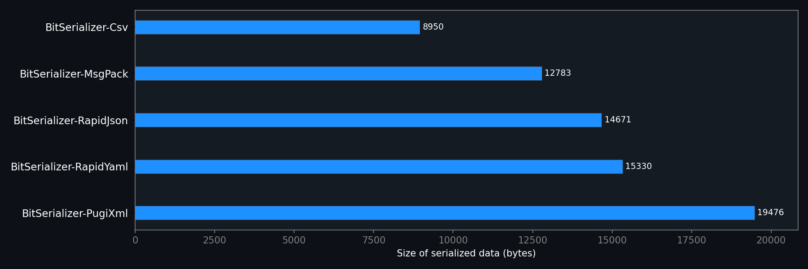

# BitSerializer  [](https://vcpkg.link/ports/bitserializer) [](https://conan.io/center/recipes/bitserializer) [](license.txt) [](https://dev.azure.com/real0793/BitSerializer/_build/latest?definitionId=5&branchName=master)

___

## Main features:
- One common interface allows easy switching between formats JSON, XML, YAML, CSV and MsgPack.
- Modular architecture lets you include only the serialization archives you need.
- Compile-time validation of format rules (e.g. JSON allows primitives as roots, while CSV only allows arrays).
- Functional serialization style similar to the Boost library.
- Support loading named fields in any order with conditional logic to preserve model compatibility.
- Customizable validation produces a detailed list of errors for deserialized values.
- Post-load refiners transform deserialized data, for example, trimming strings or setting default values.
- Seamless handling of optional and required fields, bypassing the need to use `std::optional`.
- Configurable set of policies to control overflow and type mismatch errors.
- Serialization support for almost all STD containers and types (including Unicode strings like `std::u16string`).
- Payload passthrough of unprocessed data structures with minimal serialization overhead.¹
- Enums can be serialized as integers or strings, giving you full control over representation.
- Effective deserialization from streams with bounded memory usage (built-in JSON/CSV/MsgPack archives).
- Full Unicode support with automatic detection and transcoding (except YAML).
- A powerful [string conversion submodule](docs/bitserializer_convert.md) supports enums, classes, chrono types, and UTF encoding.

¹ Payload passthrough is currently only supported by JSON archive.

> [!IMPORTANT]
> The next release will deprecate the RapidJSON-based JSON archive in favor of the new built-in implementation (`BitSerializer::Json::JsonArchive`, see `bitserializer/json_archive.h`), which requires no external dependencies. The built-in implementation is about 40% faster and offers the same functionality.
>
> Your help with testing the built-in implementation before the switch would be much appreciated — please report any issues at [BitSerializer issues](https://github.com/PavelKisliak/BitSerializer/issues).

### Supported formats:
| Component | Format | Encoding | Pretty format | Based on |
| ------ | ------ | ------ |:------:| ------ |
| [json-archive](docs/bitserializer_json.md) | JSON | UTF-8, UTF-16LE, UTF-16BE, UTF-32LE, UTF-32BE | ✅ | Built-in |
| [rapidjson-archive](docs/bitserializer_rapidjson.md) | JSON | UTF-8, UTF-16LE, UTF-16BE, UTF-32LE, UTF-32BE | ✅ | [RapidJson](https://github.com/Tencent/rapidjson) |
| [pugixml-archive](docs/bitserializer_pugixml.md) | XML | UTF-8, UTF-16LE, UTF-16BE, UTF-32LE, UTF-32BE | ✅ | [PugiXml](https://github.com/zeux/pugixml) |
| [rapidyaml-archive](docs/bitserializer_rapidyaml.md) | YAML | UTF-8 | N/A | [RapidYAML](https://github.com/biojppm/rapidyaml) |
| [csv-archive](docs/bitserializer_csv.md) | CSV | UTF-8, UTF-16LE, UTF-16BE, UTF-32LE, UTF-32BE | N/A | Built-in |
| [msgpack-archive](docs/bitserializer_msgpack.md) | MsgPack | Binary | N/A | Built-in |

### Requirements:
 - C++ 17 (VS 2019, GCC-8, CLang-8, AppleCLang-12, Clang-cl¹).
 - Supported platforms: Windows, Linux, MacOS (x86, x64, arm32, arm64, arm64be²).
 - JSON, XML and YAML archives are based on third-party libraries (there are plans to reduce dependencies).

 ¹ Versions of the RapidYaml base library less than v0.11.1 does not support Clang-cl(Windows).<br />
 ² Versions of the RapidYaml base library less than v0.7.1 may be unstable on ARM architecture.

### Limitations:
 - Work without exceptions is not supported.

___
## Table of contents
- [Hello world](#hello-world)
- [Performance overview](#performance-overview)
- [How to install](#how-to-install)
- [Unicode support](#unicode-support)
- [Serializing class](#serializing-class)
- [Serializing base class](#serializing-base-class)
- [Serializing third party class](#serializing-third-party-class)
- [Serializing a class that represents an array](#serializing-a-class-that-represents-an-array)
- [Serializing custom string types](#serializing-custom-string-types)
- [Serializing enum types](#serializing-enum-types)
- [Serializing to multiple formats](#serializing-to-multiple-formats)
- [Serialization STD types](#serialization-std-types)
  - [Serialization of std::map](#serialization-of-stdmap)
  - [Serialization of date and time](#serialization-of-date-and-time)
  - [Serialization of std::variant](#serialization-of-stdvariant)
- [Payload passthrough of unprocessed data structures](#payload-passthrough-of-unprocessed-data-structures)
- [Conditional loading and versioning](#conditional-loading-and-versioning)
- [Serialization to streams and files](#serialization-to-streams-and-files)
- [Error handling](#error-handling)
- [Validation of deserialized values](#validation-of-deserialized-values)
- [Post-load data refinement](#post-load-data-refinement)
- [Compile-time format validation](#compile-time-format-validation)
- [What else to read](#what-else-to-read)
- [Thanks](#thanks)

___

## Hello world
Let's get started with a traditional "Hello world!" example that demonstrates BitSerializer's serialization features, such as validation (e.g., email and phone number formats), post-load value refinement (trimming whitespace, case conversion, fallbacks), handling optional fields, and converting between formats (JSON to CSV).
The example highlights the flexibility of the library in handling different data types, including `std::chrono`, Unicode strings, and data integrity through required/optional constraints.
```cpp
#include <iostream>
#include "bitserializer/bit_serializer.h"
#include "bitserializer/rapidjson_archive.h"
#include "bitserializer/csv_archive.h"
#include "bitserializer/types/std/vector.h"
#include "bitserializer/types/std/chrono.h"

using namespace BitSerializer;
using JsonArchive = BitSerializer::Json::RapidJson::JsonArchive;
using CsvArchive = BitSerializer::Csv::CsvArchive;

struct CUser
{
    // Mandatory fields
    uint64_t Id = 0;
    std::u16string Name;
    std::chrono::system_clock::time_point Birthday;
    std::string Email;
    // Optional fields (maybe absent or `null` in the source JSON)
    std::string PhoneNumber;
    std::u32string NickName;
    std::string Language;

    template <class TArchive>
    void Serialize(TArchive& archive)
    {
        archive << KeyValue("Id", Id, Required());
        // Using the `Required()` validator with a custom error message (can be ID of localization string)
        archive << KeyValue("Birthday", Birthday, Required("Birthday is required"));
        archive << KeyValue("Name", Name, Required(), Validate::MaxSize(32));
        archive << KeyValue("Email", Email, Required(), Refine::TrimWhitespace(), Validate::Email());
        // Optional field (should be empty or contain a valid phone number)
        archive << KeyValue("PhoneNumber", PhoneNumber, Refine::TrimWhitespace(), Validate::PhoneNumber());
        archive << KeyValue("NickName", NickName);
        // Use fallback value "en" if missing data
        archive << KeyValue("Language", Language, Refine::ToLowerCase(), Fallback("en"));
    }
};

int main()  // NOLINT(bugprone-exception-escape)
{
    const char* sourceJson = R"([
{ "Id": 1, "Birthday": "1998-05-15T00:00:00Z", "Name": "John Doe", "Email": "john.doe@example.com", "PhoneNumber": "+(123) 4567890", "NickName": "JD" },
{ "Id": 2, "Birthday": "1993-08-20T00:00:00Z", "Name": "Alice Smith", "Email": "alice.smith@example.com", "PhoneNumber": "+(098) 765-43-21", "NickName": "Ali" },
{ "Id": 3, "Birthday": "2001-03-10T00:00:00Z", "Name": "Ivan Petrov", "Email": "ivan.petrov@example.com", "PhoneNumber": null, "Language": "RU" }
])";

    // Load list of users from JSON
    std::vector<CUser> users;
    BitSerializer::LoadObject<JsonArchive>(users, sourceJson);

    // Save to CSV
    std::string csv;
    BitSerializer::SaveObject<CsvArchive>(users, csv);

    std::cout << csv << std::endl;
    return EXIT_SUCCESS;
}
```
Example output:
```
Id,Birthday,Name,Email,PhoneNumber,NickName,Language
1,1998-05-15T00:00:00.0000000Z,John Doe,john.doe@example.com,+(123) 4567890,JD,en
2,1993-08-20T00:00:00.0000000Z,Alice Smith,alice.smith@example.com,+(098) 765-43-21,Ali,en
3,2001-03-10T00:00:00.0000000Z,Ivan Petrov,ivan.petrov@example.com,,,ru
```
BitSerializer treats missing fields as optional by default, but you can enforce mandatory fields using the `Required()` validator. This approach eliminates the need for workarounds like using `std::optional`, simplifying your business logic by avoiding repetitive checks for value existence. The library's robust validation system collects all invalid fields during deserialization, enabling comprehensive error reporting (with localization support if needed). Additionally, BitSerializer ensures type safety by throwing exceptions for type mismatches or overflow errors, such as when deserializing values that exceed the capacity of the target type.

## Performance overview
BitSerializer prioritizes reliability and usability, but we understand that performance remains a critical factor for serialization libraries.
This chapter provides an overview of the performance characteristics of BitSerializer across various serialization formats, as well as comparative tests with the used third-party libraries.

### Key performance insights
- Formats implemented natively in BitSerializer (MsgPack and CSV) demonstrate excellent performance due to their DOM-free architecture. This approach eliminates intermediate object tree construction, enabling direct serialization/deserialization to/from streams.
- Formats relying on external libraries (RapidJSON, PugiXML, RapidYAML) show an average performance loss of ~5% compared to their native APIs. This minor trade-off is due to the unified BitSerializer abstraction layer, which provides consistent behavior across all supported formats.
- All formats support non-linear loading of named fields, but maximum performance can be achieved when loading in the same order. This feature is important for compatibility and flexibility when working with complex models (e.g. for updating models).

### Comparing "Parsers" and "Serializers" library classes
It is important to note that comparing "Serialization" classes (like BitSerializer) with "Parser" classes (such as RapidJSON, NlohmannJson, PugiXML, or RapidYAML) may not always be entirely fair. These two categories of libraries differ fundamentally in their design and purpose:
- **Parsers:** Typically operate on a DOM-based model, where the entire document is loaded into memory before processing. This approach is well-suited for tasks requiring extensive manipulation of the data structure but can introduce overhead during serialization and deserialization.
- **Serializers:** Focus on streaming serialization, where data is processed incrementally without the need to build an intermediate DOM. This approach is generally faster and more memory-efficient but may lack some of the advanced manipulation features offered by parsers.

It should be noted, that the historical distinction between "DOM parsers" and "stream serializers" is increasingly blurred by modern libraries offering hybrid approaches (e.g. SAX, "on demand").

In this performance analysis, we have benchmarked BitSerializer against the base libraries it relies on (e.g., RapidJSON, PugiXML, and RapidYAML).
These libraries are primarily "Parser" classes, and the performance differences observed reflect the inherent trade-offs between DOM-based parsing and streaming serialization. 

We understand that comparing "Serialization" classes with "Parser" classes might not always be equitable due to the fundamental differences in their nature (e.g., DOM vs. streaming serialization). However, this comparison provides valuable insights into how BitSerializer performs relative to the libraries it builds upon.

### Comparison of serialized data size
In addition to performance metrics, the size of the serialized output is another important factor to consider when choosing a serialization format.
Below is a comparison of the serialized output sizes (in bytes) for the same test model using different formats:



Binary formats like MsgPack produce significantly smaller outputs compared to text-based formats like JSON, XML, or YAML.
The CSV format is the most compact among all tested formats, making it an excellent choice for storage and transmission of tabular data.

### Performance test methodology
- ***Metrics:*** To evaluate the performance of BitSerializer, we measure the number of fields processed per millisecond (`fields/ms`) during serialization and deserialization. This metric allows us to objectively compare the efficiency of different formats and libraries.
- **Test model:** The [test model](benchmarks/archives/test_model.h) consists of an array of objects containing various data types compatible with all supported formats. This ensures a fair comparison of formats since the same data structure is used for all tests.

### Performance test results


For most applications, BitSerializer provides the optimal combination of reliability, feature completeness, and performance. Developers working with MsgPack/CSV will see best-in-class speeds, while users needing JSON/XML/YAML benefit from consistent performance with minimal overhead compared to format-specific libraries.

## How to install
Some archives (JSON, XML and YAML) require third-party libraries, but you can install only the ones which you need.
The easiest way is to use one of supported package managers, in this case, third-party libraries will be installed automatically.
Please follow [instructions](#what-else-to-read) for specific archives.

### VCPKG
Just add BitSerializer to manifest file (`vcpkg.json`) in your project:
```json
{
    "dependencies": [
        {
            "name": "bitserializer",
            "features": [ "rapidjson-archive", "pugixml-archive", "rapidyaml-archive", "csv-archive", "msgpack-archive" ]
        }
    ]
}
```
The latest available version: [](https://vcpkg.link/ports/bitserializer)

Enumerate features which you need, by default all are disabled. Use like as usual in the [Cmake](#how-to-use-with-cmake).

Alternatively, you can install the library via the command line:
```shell
> vcpkg install bitserializer[rapidjson-archive,pugixml-archive,rapidyaml-archive,csv-archive,msgpack-archive]
```
In the square brackets enumerated all available formats, install only which you need.

### Conan 2
The recipe of BitSerializer is available on [Conan-center](https://github.com/conan-io/conan-center-index), just add BitSerializer to `conanfile.txt` in your project and enable archives which you need via options (by default all are disabled):
```
[requires]
bitserializer/x.xx

[options]
bitserializer/*:with_rapidjson=True
bitserializer/*:with_pugixml=True
bitserializer/*:with_rapidyaml=True
bitserializer/*:with_csv=True
bitserializer/*:with_msgpack=True
```
Replace `x.xx` with the latest available version: [](https://conan.io/center/recipes/bitserializer)

### Installation via CMake on a Unix system
```sh
$ git clone https://github.com/PavelKisliak/BitSerializer.git
$ # Enable only archives which you need (by default all are disabled)
$ cmake bitserializer -B bitserializer/build -DBUILD_RAPIDJSON_ARCHIVE=ON -DBUILD_PUGIXML_ARCHIVE=ON -DBUILD_RAPIDYAML_ARCHIVE=ON -DBUILD_CSV_ARCHIVE=ON -DBUILD_MSGPACK_ARCHIVE=ON
$ sudo cmake --build bitserializer/build --config Debug --target install
$ sudo cmake --build bitserializer/build --config Release --target install
```
By default, will be built a static library, add the CMake parameter `-DBUILD_SHARED_LIBS=ON` to build shared.
You will also need to install dev-packages of base libraries (CSV and MsgPack archives do not require any dependencies), currently available only `rapidjson-dev` and `libpugixml-dev`, the RapidYaml library needs to be compiled manually.

> [!IMPORTANT]
> Make sure your application and library are compiled with the same options (C++ standard, optimization flags, runtime type, etc.) to avoid binary incompatibility issues.

### How to use with CMake
```cmake
find_package(bitserializer CONFIG REQUIRED)
# Link only archives which you need
target_link_libraries(${PROJECT_NAME} PRIVATE
    BitSerializer::rapidjson-archive
    BitSerializer::pugixml-archive
    BitSerializer::rapidyaml-archive
    BitSerializer::csv-archive
    BitSerializer::msgpack-archive
)
```

### How to use with CMake FetchContent
Instead of installing the library, you can download and build it as part of your own CMake project:
```cmake
include(FetchContent)

FetchContent_Declare(bitserializer
    GIT_REPOSITORY https://github.com/PavelKisliak/BitSerializer.git
    GIT_TAG <version-tag>)  # e.g. the latest release tag, or a branch/commit hash

# Enable only archives which you need (by default all are disabled)
set(BUILD_JSON_ARCHIVE    ON CACHE BOOL "" FORCE)
set(BUILD_CSV_ARCHIVE     ON CACHE BOOL "" FORCE)
set(BUILD_MSGPACK_ARCHIVE ON CACHE BOOL "" FORCE)
# Third-party archives (JSON via RapidJSON, XML, YAML) are also available:
# set(BUILD_RAPIDJSON_ARCHIVE ON CACHE BOOL "" FORCE)
# set(BUILD_PUGIXML_ARCHIVE   ON CACHE BOOL "" FORCE)
# set(BUILD_RAPIDYAML_ARCHIVE ON CACHE BOOL "" FORCE)
# Keep the fetched dependency lean
set(BUILD_TESTS      OFF CACHE BOOL "" FORCE)
set(BUILD_SAMPLES    OFF CACHE BOOL "" FORCE)
set(BUILD_BENCHMARKS OFF CACHE BOOL "" FORCE)

FetchContent_MakeAvailable(bitserializer)

target_link_libraries(${PROJECT_NAME} PRIVATE
    BitSerializer::json-archive
    BitSerializer::csv-archive
    BitSerializer::msgpack-archive)
```

The built-in archives (JSON, CSV, MsgPack) require no third-party libraries and are the simplest option for `FetchContent`. Archives based on third-party libraries (`RapidJSON`, `PugiXml`, `RapidYAML`) rely on `find_package()`, so make sure their dependencies are discoverable (for example, by setting the VCPKG toolchain file) before `FetchContent_MakeAvailable()`.

> [!NOTE]
> Replace `<version-tag>` with the [latest release](https://github.com/PavelKisliak/BitSerializer/releases) tag to pin a specific version; `GIT_TAG` can also be a branch name or a commit hash. The built-in JSON archive (`BitSerializer::json-archive`) is already available on `master`, but not yet published in a release — until then, set `GIT_TAG master` to use it.

> [!TIP]
> Add `GIT_SHALLOW TRUE` to `FetchContent_Declare()` for a faster clone when `GIT_TAG` is a tag or branch (it is ignored for commit hashes):
> ```cmake
> FetchContent_Declare(bitserializer
>     GIT_REPOSITORY https://github.com/PavelKisliak/BitSerializer.git
>     GIT_TAG <version-tag>
>     GIT_SHALLOW TRUE)
> ```
> On CMake 3.24+ you can also prefer an already installed package and only download as a fallback via [`FIND_PACKAGE_ARGS`](https://cmake.org/cmake/help/latest/module/FetchContent.html#command:fetchcontent_declare):
> ```cmake
> FetchContent_Declare(bitserializer
>     GIT_REPOSITORY https://github.com/PavelKisliak/BitSerializer.git
>     GIT_TAG <version-tag>
>     FIND_PACKAGE_ARGS CONFIG)
> ```
> The downloaded sources are cached in `${CMAKE_BINARY_DIR}/_deps` and reused on subsequent configures.

If you prefer not to build the library at all, the [GitHub Releases](https://github.com/PavelKisliak/BitSerializer/releases) page provides prebuilt packages for some platforms and compilers. Each package contains headers, the `share/bitserializer` CMake config, and static libraries for all archives, but **not** their third-party dependencies (RapidJSON, PugiXml, RapidYAML) — you still need to install those yourself if you use the corresponding archives. Unpack the package and point `find_package()` at its `share/bitserializer` directory:
```cmake
find_package(bitserializer CONFIG REQUIRED
    PATHS ${CMAKE_CURRENT_SOURCE_DIR}/libs/bitserializer/share/bitserializer
    NO_DEFAULT_PATH)
```
> [!IMPORTANT]
> Prebuilt packages are tied to a specific compiler, platform, C++ standard, linkage, and (on Windows) runtime library. Make sure they match your application exactly, or build from source instead.

## Unicode support
BitSerializer provides comprehensive Unicode support by enabling serialization of any `std::basic_string` type (e.g., `std::u8string`, `std::u16string`, `std::u32string`) while automatically handling transcoding to the target output format. You can also use any string type as keys, but keep in mind that transcoding incurs additional processing overhead. For optimal performance, prefer UTF-8 strings, as they are natively supported by all archives and minimize transcoding costs. 

The example below demonstrates how BitSerializer seamlessly handles different string types and encodings: 
```cpp
class TestUnicodeClass
{
public:
    template <class TArchive>
    void Serialize(TArchive& archive)
    {
        // Serialize a UTF-8 string with key in UTF-16
        archive << KeyValue(u"Utf16Key", mUtf8StringValue);

        // Serialize a UTF-16 string with key in UTF-32
        archive << KeyValue(U"Utf32Key", mUtf16StringValue);

        // Serialize a UTF-32 string with key in UTF-8
        archive << KeyValue(u8"Utf8Key", mUtf32StringValue);
    };

private:
    std::string mUtf8StringValue;       // UTF-8 encoded string
    std::u16string mUtf16StringValue;   // UTF-16 encoded string
    std::u32string mUtf32StringValue;   // UTF-32 encoded string
};
```
This flexibility allows you to work with various Unicode encodings without worrying about manual transcoding.
However, for best results, use UTF-8 consistently unless your application specifically requires other encodings.

## Serializing class
There are two ways to serialize a class:

  * Internal public method `Serialize()` - good way for your own classes.
  * External global function `SerializeObject()` - used for third party class (no access to sources).

Below example demonstrates how to implement internal serialization method:
```cpp
#include "bitserializer/bit_serializer.h"
#include "bitserializer/rapidjson_archive.h"

using JsonArchive = BitSerializer::Json::RapidJson::JsonArchive;

class TestSimpleClass
{
public:
    TestSimpleClass()
        : testBool(true)
        , testString(L"Hello world!")
    {
        for (size_t i = 0; i < 3; i++)
        {
            for (size_t k = 0; k < 2; k++) {
                testTwoDimensionArray[i][k] = i * 10 + k;
            }
        }
    }

    template <class TArchive>
    void Serialize(TArchive& archive)
    {
        using namespace BitSerializer;
        archive << KeyValue("TestBool", testBool);
        archive << KeyValue("TestString", testString);
        archive << KeyValue("TestTwoDimensionArray", testTwoDimensionArray);
    };

private:
    bool testBool;
    std::wstring testString;
    size_t testTwoDimensionArray[3][2];
};

int main()
{
    auto simpleObj = TestSimpleClass();
    auto result = BitSerializer::SaveObject<JsonArchive>(simpleObj);
    return 0;
}
```
Returns result
```json
{
    "TestBool": true,
    "TestString": "Hello world!",
    "TestTwoDimensionArray": [
        [0, 1],
        [10, 11],
        [20, 21]
    ]
}
```
For serializing a named object please use helper class `KeyValue` which takes `key` and `value` as constructor arguments. Usually the type of key is UTF-8 string, but you are free to use any other convertible type (`std::u16string`, `std::u32string` or any numeric types). For example, MsgPack archive has native support for numbers as keys, they will be converted to string when use with another archives. For get maximum performance, better to avoid any conversions.

> [!TIP]
> For multi-format code, consider using `PropertyValue` instead of `KeyValue` if you want scalar fields to be serialized as XML attributes automatically. See [Serializing to multiple formats](#serializing-to-multiple-formats) for details.

## Serializing base class
To serialize the base class, use the helper method `BaseObject()`, like as in the next example.
```cpp
template <class TArchive>
void Serialize(TArchive& archive)
{
    archive << BaseObject<MyBaseClass>(*this);
    archive << KeyValue("TestInt", TestInt);
};
```
> [!NOTE]
> Version 0.75 and earlier support serialization of the base class only via the internal `Serialize()` method.

## Serializing third party class
As alternative for internal `Serialize()` method also exists approach with defining global functions, it will be useful in next cases:

 - Sources of serializing class cannot be modified (for example from third party library).
 - When class represents list of some values (such as `std::vector`), see [next chapter](#serializing-class-that-represent-an-array).
 - When you strongly follow single responsibility principle and wouldn't like to include serialization code into class.

> [!NOTE]
> Internal `Serialize()` method has higher priority than global one (in v0.75 was a priority for the global function).

You need to implement `SerializeObject()` in the same namespace as the serializing class, or in `BitSerializer`:
```cpp
class TestThirdPartyClass
{
public:
    TestThirdPartyClass(int x, int y) noexcept
        : x(x), y(y)
    { }

    // Example of public property
    int x;

    // Example of property that is only accessible via a getter/setter
    [[nodiscard]] int GetY() const noexcept { return y; }
    void SetY(const int inY) noexcept { this->y = inY; }

private:
    int y;
};

// Serializes TestThirdPartyClass.
template<typename TArchive>
void SerializeObject(TArchive& archive, TestThirdPartyClass& testThirdPartyClass)
{
    // Serialize public property
    archive << KeyValue("x", testThirdPartyClass.x);

    // Serialize private property
    if constexpr (TArchive::IsLoading())
    {
        int y = 0;
        archive << KeyValue("y", y);
        testThirdPartyClass.SetY(y);
    }
    else
    {
        const int y = testThirdPartyClass.GetY();
        archive << KeyValue("y", y);
    }
}
```
[See full sample](samples/serialize_third_party_class/serialize_third_party_class.cpp)

## Serializing a class that represents an array
In this chapter described how to serialize your own class that represent a list of values (similar to `std::vector`).
For this purpose, need to implement a global function `SerializeArray()` in the same namespace as the serializing class, or in `BitSerializer`.

Additionally, BitSerializer wants to know the number of elements in the list.
This is optional for a text archives like JSON, but mandatory for a binary archive like MsgPack since it stores the size prior the array elements.
The size of list can be obtained via one of the following ways:

 - Global function `size(const CMyArray&)` in the same namespace as the serializing class (highest priority).
 - Standard class method `size()`.
 - By enumerating array elements using iterators (like as for `std::forward_list`).

So, in case if your class has a different signature for the size getter than `size()`, then you need to implement it as a global function.

Please take a look at the following example:
```cpp
// Some custom array type
template <typename T>
class CMyArray
{
public:
    CMyArray() = default;
    CMyArray(std::initializer_list<T> initList)
        : mArray(initList)
    { }

    [[nodiscard]] size_t GetSize() const noexcept { return mArray.size(); }
    void Resize(size_t newSize) { mArray.resize(newSize); }

    [[nodiscard]] const T& At(size_t index) const { return mArray.at(index); }
    [[nodiscard]] T& At(size_t index) { return mArray.at(index); }

    T& PushBack(T&& value) { return mArray.emplace_back(std::forward<T>(value)); }

private:
    std::vector<T> mArray;
};

// Returns the size of the CMyArray.
template <class T>
size_t size(const CMyArray<T>& cont) noexcept { return cont.GetSize(); }

// Serializes CMyArray.
template <class TArchive, class TValue>
void SerializeArray(TArchive& arrayScope, CMyArray<TValue>& cont)
{
    if constexpr (TArchive::IsLoading())
    {
        // Resize container when approximate size is known
        if (const auto estimatedSize = arrayScope.GetEstimatedSize(); estimatedSize != 0 && cont.GetSize() < estimatedSize) {
            cont.Resize(estimatedSize);
        }

        // Load
        size_t loadedItems = 0;
        for (; !arrayScope.IsEnd(); ++loadedItems)
        {
            TValue& value = (loadedItems < cont.GetSize()) ? cont.At(loadedItems) : cont.PushBack({});
            Serialize(arrayScope, value);
        }
        // Resize container for case when loaded items less than there are or were estimated
        cont.Resize(loadedItems);
    }
    else
    {
        for (size_t i = 0; i < cont.GetSize(); ++i)
        {
            Serialize(arrayScope, cont.At(i));
        }
    }
}
```
[See full sample](samples/serialize_custom_array/serialize_custom_array.cpp)

Additional recommendations:
 - Don't clear arrays, prefer loading values into existing elements (for better performance).
 - Resize array before loading if estimated size is not zero (but please keep in mind that the actual size may vary).
 - For fixed size arrays, always check the size of the array and the elements actually loaded (throw an exception if they differ).
 - Use [std containers serialization implementation](include/bitserializer/types/std) as examples.

## Serializing custom string types
Most frameworks/engines have their own implementation of the string type, and most likely you will want to add support for serializing these types.
BitSerializer allows you to do this efficiently by using `std::basic_string_view<>` as an intermediate type, which supports any character type.

To declare your own `std::string` alternative (e.g. `MyString`) as a string-like type, use the `BITSERIALIZER_DECLARE_STRING_TYPE` macro.
If the type's method names don't follow the `std::basic_string` convention (`data()`, `size()`, `assign()`), use the `_EXPLICIT` variant to point at them.
Both generate the necessary `StringViewOf()` / `AssignString()` functions (found via ADL) that provide a **zero-copy** view of the string data on save and assign it on load:
```cpp
// Some custom string type
class MyString
{
public:
    MyString() = default;
    MyString(const char* str) : mString(str) { }

    bool operator<(const MyString& rhs) const { return this->mString < rhs.mString; }

    const char* Data() const noexcept { return mString.data(); }
    size_t Size() const noexcept { return mString.size(); }

    void FromString(std::string_view str) { mString = str; }

private:
    std::string mString;
};

// Declares MyString as a string-like type (must be placed in the same namespace as the type)
BITSERIALIZER_DECLARE_STRING_TYPE_EXPLICIT(MyString, &MyString::Data, &MyString::Size, &MyString::FromString)
```

That's all you need for both serialization with and without **key** (objects and arrays). If your class exposes the standard `std::basic_string` style method names `data()`, `size()` and `assign(std::string_view)`, you can use the shorter form:
```cpp
BITSERIALIZER_DECLARE_STRING_TYPE(MyString)
```

The macro relies on the [convert sub-module](docs/bitserializer_convert.md) so that string types can also be used as keys, for example it allows serialization of `std::map<MyString, int>` where `MyString` is used as a key.

> [!NOTE]
> `BITSERIALIZER_DECLARE_STRING_TYPE` is not available in the previous version 0.85.

```cpp
int main()
{
    // Save list of custom strings to JSON
    std::vector<MyString> srcStrList = { "Red", "Green", "Blue" };
    std::string jsonResult;
    SerializationOptions serializationOptions;
    serializationOptions.formatOptions.enableFormat = true;
    BitSerializer::SaveObject<JsonArchive>(srcStrList, jsonResult, serializationOptions);
    std::cout << "Saved JSON: " << jsonResult << std::endl;

    // Load JSON-object to std::map based on custom strings
    std::map<MyString, MyString> mapResult;
    const std::string srcJson = R"({ "Background": "Blue", "PenColor": "White", "PenSize": "3", "PenOpacity": "50" })";
    BitSerializer::LoadObject<JsonArchive>(mapResult, srcJson);
    std::cout << std::endl << "Loaded map: " << std::endl;
    for (const auto& val : mapResult)
    {
        std::cout << "\t" << Convert::To<std::string>(val.first) << ": " << Convert::To<std::string>(val.second) << std::endl;
    }

    return 0;
}
```
[See full sample](samples/serialize_custom_string/serialize_custom_string.cpp)

## Serializing enum types
Enum types can be serialized as integers or as strings, as you prefer.
By default, they serializing as strings, to serialize as integers, use the `EnumAsBin` wrapper:
```cpp
archive << KeyValue("EnumValue", EnumAsBin(enumValue));
```
To be able to serialize `enum` types as string, you need to register a map with string equivalents in the your HEADER file.
```cpp
// file HttpMethods.h
#pragma once
#include "bitserializer\convert.h"

enum class HttpMethod {
    Delete = 1,
    Get = 2,
    Head = 3
};

BITSERIALIZER_REGISTER_ENUM(HttpMethod, {
    { HttpMethod::Delete,   "delete" },
    { HttpMethod::Get,      "get" },
    { HttpMethod::Head,     "head" }
})

// Optionally, you can declare stream operators (`<<` and `>>`) for the registered enum type
BITSERIALIZER_DECLARE_ENUM_STREAM_OPS(HttpMethod)
```
> [!NOTE]
> In the previous version 0.80, used the REGISTER_ENUM and DECLARE_ENUM_STREAM_OPS macros.

## Serializing to multiple formats
One of the core advantages of BitSerializer is the ability to serialize objects into multiple formats through a unified interface. The following example demonstrates how to save the same object to JSON and XML with minimal code changes:
```cpp
class CPoint
{
public:
    CPoint(int x, int y)
        : x(x), y(y)
    { }

    template <class TArchive>
    void Serialize(TArchive& archive)
    {
        archive << KeyValue("x", x);
        archive << KeyValue("y", y);
    }

    int x, y;
};

int main()
{
    auto testObj = CPoint(100, 200);

    const auto jsonResult = BitSerializer::SaveObject<JsonArchive>(testObj);
    std::cout << "JSON: " << jsonResult << std::endl;

    const auto xmlResult = BitSerializer::SaveObject<XmlArchive>(testObj);
    std::cout << "XML: " << xmlResult << std::endl;
    return 0;
}
```
Output:
```
JSON: {"x":100,"y":200}
XML: <?xml version="1.0"?><root><x>100</x><y>200</y></root>
```
The serialization logic differs only in the template parameter (`JsonArchive` vs `XmlArchive`). However, there are two aspects worth addressing for production use.

### Root node naming
As shown above, XML output contains an auto-generated root node named "root" when no explicit name is provided. This behavior ensures structural consistency across formats but can be customized:
```cpp
// Specify explicit root node name for XML
const auto xmlResult = BitSerializer::SaveObject<XmlArchive>(KeyValue("Point", testObj));
```
Output:
```xml
<?xml version="1.0"?><Point><x>100</x><y>200</y></Point>
```

### Customizing XML structure
By default, all fields are serialized as XML elements. However, XML supports attributes, which can produce more compact and idiomatic output for scalar values. BitSerializer provides three approaches to handle this:

#### Option 1: Manual format detection (explicit control)
Use `if constexpr` to apply format-specific logic:
```cpp
template <class TArchive>
void Serialize(TArchive& archive)
{
    if constexpr (TArchive::archive_type == ArchiveType::Xml)
    {
        archive << AttributeValue("x", x);
        archive << AttributeValue("y", y);
    }
    else
    {
        archive << KeyValue("x", x);
        archive << KeyValue("y", y);
    }
}
```

#### Option 2: Smart wrapper (recommended for multi-format code)
Use `PropertyValue` for automatic adaptation based on archive type and value convertibility:
```cpp
template <class TArchive>
void Serialize(TArchive& archive)
{
    // Scalar types → XML attribute, JSON key
    archive << PropertyValue("x", x);
    archive << PropertyValue("y", y);
    
    // Complex types → XML element, JSON key (automatic fallback)
    archive << PropertyValue("profile", mProfile);
}
```

#### Option 3: Strict XML attributes (XML-only code)
Use `AttributeValue` when targeting XML exclusively:
```cpp
template <class TArchive>
void Serialize(TArchive& archive)
{
    archive << AttributeValue("x", x);
    archive << AttributeValue("y", y);
}
```

> [!NOTE]
> Note: `AttributeValue` causes a compile-time error when used with non-XML archives (JSON, YAML, CSV, MsgPack).

#### Comparison of helper classes
| Approach       | JSON                | XML                                 |
| -------------- | ------------------- | ----------------------------------- |
| KeyValue       | `{"x":100,"y":200}` | `<root><x>100</x><y>200</y></root>` |
| AttributeValue | ❌ Compile error    | `<root x="100" y="200"/>`           |
| PropertyValue  | `{"x":100,"y":200}` | `<root x="100" y="200"/>`           |

> [!NOTE]
> `PropertyValue` automatically falls back to `KeyValue` for complex types (objects, arrays) that cannot be represented as XML attributes. This behavior is determined at compile time using `BitSerializer::Convert::IsConvertible<TValue, std::string>()`.

[See full sample](samples/multiformat_customization/multiformat_customization.cpp)

## Serialization STD types
BitSerializer has built-in serialization for all STD containers and most other commonly used types. For add support of required STD type just need to include related header file.
| Types  | Header |
| ------ | ------ |
| std::basic_string<>, std::pmr::basic_string<> | Part of the basic package |
| std::byte | Part of the basic package |
| std::atomic | #include "bitserializer/types/std/atomic.h" |
| std::array | #include "bitserializer/types/std/array.h" |
| std::vector, std::pmr::vector | #include "bitserializer/types/std/vector.h" |
| std::deque, std::pmr::deque | #include "bitserializer/types/std/deque.h" |
| std::bitset | #include "bitserializer/types/std/bitset.h" |
| std::list, std::pmr::list | #include "bitserializer/types/std/list.h" |
| std::forward_list, std::pmr::forward_list | #include "bitserializer/types/std/forward_list.h" |
| std::queue, std::priority_queue | #include "bitserializer/types/std/queue.h" |
| std::stack | #include "bitserializer/types/std/stack.h" |
| std::set, std::multiset, std::pmr::set, std::pmr::multiset | #include "bitserializer/types/std/set.h" |
| std::unordered_set, std::unordered_multiset,<br>std::pmr::unordered_set, std::pmr::unordered_multiset | #include "bitserializer/types/std/unordered_set.h" |
| std::map, std::multimap, std::pmr::map, std::pmr::multimap | #include "bitserializer/types/std/map.h" |
| std::unordered_map, std::unordered_multimap,<br>std::pmr::unordered_map, std::pmr::unordered_multimap | #include "bitserializer/types/std/unordered_map.h" |
| std::valarray | #include "bitserializer/types/std/valarray.h" |
| std::pair | #include "bitserializer/types/std/pair.h" |
| std::tuple | #include "bitserializer/types/std/tuple.h" |
| std::optional | #include "bitserializer/types/std/optional.h" |
| std::variant | #include "bitserializer/types/std/variant.h" |
| std::unique_ptr, std::shared_ptr | #include "bitserializer/types/std/memory.h" |
| std::chrono::time_point, chrono::duration | #include "bitserializer/types/std/chrono.h" |
| std::time_t | #include "bitserializer/types/std/ctime.h" |
| std::filesystem::path | #include "bitserializer/types/std/filesystem.h" |

Few words about serialization smart pointers. There is no any system footprints in output archive, for example empty smart pointer will be serialized as `NULL` type in JSON or in any other suitable way for other archive types. When an object is loading into an empty smart pointer, it will be created, and vice versa, when the loaded object is `NULL` or does not exist, the smart pointer will be reset. Polymorphism are not supported you should take care about such types by yourself.

### Serialization of std::map
BitSerializer does not add any system information when saving the map, for example serialization to JSON would look like this:
```cpp
std::map<std::string, int> testMap = 
    { { "One", 1 }, { "Two", 2 }, { "Three", 3 }, { "Four", 4 }, { "Five", 5 } };
auto jsonResult = BitSerializer::SaveObject<JsonArchive>(testMap);
```
Returns result
```json
{
    "Five": 5,
    "Four": 4,
    "One": 1,
    "Three": 3,
    "Two": 2
}
```

Below is a more complex example, where loading a vector of maps from JSON.
```json
[{
    "One": 1,
    "Three": 3,
    "Two": 2
}, {
    "Five": 5,
    "Four": 4
}]
```
Code:
```cpp
std::vector<std::map<std::string, int>> testVectorOfMaps;
const std::string inputJson = R"([{"One":1,"Three":3,"Two":2},{"Five":5,"Four":4}])";
BitSerializer::LoadObject<JsonArchive>(testVectorOfMaps, inputJson);
```

Since all of the most well-known text formats (such as JSON) allow only text keys, BitSerializer attempts to convert the map key to a string (except binary formats like MsgPack).
Out of the box, the library supports all the fundamental types (e.g. `bool`, `int`, `float`) as well as some of the `std` ones (`filesystem::path`, `chrono::timepoint`, etc), but if you want to use your own type as the key, you need to implement the conversion to a string. There are several options with internal and external functions, see details [here](docs\bitserializer_convert.md). For example, you can implement two internal methods in your type:
```cpp
class YourCustomKey
{
    std::string ToString() const { }
    void FromString(std::string_view str)
}
```

### Serialization of date and time
The ISO 8601 standard was chosen as the representation for the date, time and duration for text type of archives (JSON, XML, YAML, CSV). The MsgPack archive has its own compact time format. For enable serialization of the `std::chrono` and `time_t`,  just include these headers:
```cpp
#include "bitserializer/types/std/chrono.h"
#include "bitserializer/types/std/ctime.h"
```

The following table contains all supported types with examples of string representations:

| Type | Format | Examples | References |
| ------ | ------ | ------ | ------ |
| `std::time_t` | YYYY-MM-DDThh:mm:ssZ | 1677-09-21T00:12:44Z<br>2262-04-11T23:47:16Z | [ISO 8601/UTC](https://en.wikipedia.org/wiki/ISO_8601) |
| `chrono::time_point` | [±]YYYY-MM-DDThh:mm:ss[.SSS]Z | 1872-01-01T04:55:32.021Z<br>2262-04-11T23:47:16Z<br>9999-12-31T23:59:59.999Z<br>+12376-01-20T00:00:00Z<br>-1241-06-23T00:00:00Z | [ISO 8601/UTC](https://en.wikipedia.org/wiki/ISO_8601)  |
| `chrono::duration` | [±]PnWnDTnHnMnS | P125DT55M41S<br>PT10H20.346S<br>P10DT25M<br>P35W5D | [ISO 8601/Duration](https://en.wikipedia.org/wiki/ISO_8601#Durations)  |

Time point notes:
- Only UTC representation is supported, fractions of a second are optional ([±]YYYY-MM-DDThh:mm:ss[.SSS]Z).
- ISO-8601 doesn't specify precision for fractions of second, BitSerializer supports up to 9 digits, which is enough for values with nanosecond precision.
- Both decimal separators (dot and comma) are supported for fractions of a second.
- According to standard, to represent years before 0000 or after 9999 uses additional '-' or '+' sign.
- The date range depends on the `std::chrono::duration` type, for example implementation of `system_clock` on Linux has range **1678...2262 years**.
- Keep in mind that `std::chrono::system_clock` has time point with different duration on Windows and Linux, prefer to store time in custom `time_point` if you need predictable range (e.g. `time_point<system_clock, milliseconds>`).
- According to the C++20 standard, the EPOCH date for `system_clock` types is considered as *1970-01-01 00:00:00 UTC* excluding leap seconds.
- For avoid mistakes, time points with **steady_clock**  type are not allowed due to floating EPOCH.
- Allowed rounding only fractions of seconds, in all other cases an exception is thrown (according to `OverflowNumberPolicy`).

Duration notes:
- Supported a sign character at the start of the string (ISO 8601-2 extension).
- Durations which contains years, month, or with base UTC (2003-02-15T00:00:00Z/P2M) are not allowed.
- The decimal fraction supported only for seconds part, maximum 9 digits.
- Both decimal separators (dot and comma) are supported for fractions of a second.
- Allowed rounding only fractions of seconds, in all other cases an exception is thrown (according to `OverflowNumberPolicy`).

Since `std::time_t` is equal to `int64_t`, need to use special wrapper `CTimeRef`, otherwise time will be serialized as number.
```cpp
template <class TArchive>
void Serialize(TArchive& archive)
{
    archive << KeyValue("Time", CTimeRef(timeValue));
}
```

### Serialization of std::variant
A `std::variant` can hold a value of one of several types, so the serialized data must somehow record **which** alternative is active. There is no single canonical way to do this, and different ecosystems have converged on different conventions. BitSerializer supports the most popular of them and lets you pick the one that best fits your format and use case (only CSV is limited when nested objects are involved).

Because the active type information is stored as part of the value, a variant is serialized as an object - so this feature requires object support in the target archive. Include the header to enable serialization:
```cpp
#include "bitserializer/types/std/variant.h"
```

#### Available representations
| Representation | JSON example (active `User` alternative) | Registration | Objects only |
| --- | --- | --- | --- |
| Index-based | `{ "index": 2, "value": { "name": "Rob", "age": 30 } }` | ❌ No | ❌ No |
| Name-based | `{ "type": "User", "value": { "name": "Rob", "age": 30 } }` | ✅ Yes | ❌ No |
| Discriminated | `{ "type": "User", "name": "Rob", "age": 30 }` | ✅ Yes | ✅ Yes |

- **Index-based** is the default (wrapper: `VariantAsIndexed`). Requires no setup and works with any alternative type, but the index is unstable if the list of alternatives changes.
- **Name-based** (wrapper: `VariantAsNamed`) encodes the type by a stable registered name and supports any alternative type, but nests the value.
- **Discriminated** (wrapper: `VariantAsDiscriminated`) flattens the type name next to the alternative's fields (the OpenAPI `discriminator` style), which is what enables object hierarchies in flat formats such as CSV - but every alternative must be an object type.

All three representations support customizable field names.

The index-based and name-based representations nest the value under a separate key; the discriminated representation merges it with the discriminator. The rest of this section walks through each in detail.

#### Selecting the default representation
By default the active alternative is encoded by its **integer index** (see below). You can change the default for **every** `std::variant` value in a serialization call - including elements of containers and arbitrarily nested variants - via `SerializationOptions::variantOptions`:
```cpp
BitSerializer::SerializationOptions options;
options.variantOptions.mode = BitSerializer::VariantSerializationMode::Named; // Indexed, Named or Discriminated
options.variantOptions.typeKey = "kind";   // discriminator key (Named/Discriminated)
options.variantOptions.valueKey = "payload"; // value key (Indexed/Named)
options.variantOptions.indexKey = "idx";   // index key (Indexed)

std::string jsonResult;
BitSerializer::SaveObject<JsonArchive>(testValue, jsonResult, options);
```
The `Indexed` mode is the default and requires no setup. The `Named` mode requires every alternative to be registered with `BITSERIALIZER_REGISTER_TYPE`, and the alternatives are serialized as `{ type, value }` objects - so it inherits the same constraints as the `VariantAsNamed` wrapper. The `Discriminated` mode requires every alternative to be both registered and an object type - so it inherits the same constraints as the `VariantAsDiscriminated` wrapper. If a selected mode is not available for the given alternatives (e.g. `Discriminated` for a variant holding scalars), a `SerializationException` is thrown at runtime. An explicit `VariantAs*` wrapper always overrides the configured default for that value; because it picks the representation explicitly, an unsupported combination is reported at compile time (`static_assert`) instead of at runtime.

By default the active alternative is encoded by its **integer index**:
```cpp
using VariantType = std::variant<int, std::string, User, std::vector<int>>;
VariantType testValue(User("Alice", 30));
auto jsonResult = BitSerializer::SaveObject<JsonArchive>(testValue);
```
Returns result:
```json
{ "index": 2, "value": { "name": "Alice", "age": 30 } }
```

The index-based representation requires no additional setup, but the index is unstable if the list of alternatives changes. For a more stable and human-readable format, use the `VariantAsNamed` wrapper, which encodes the active type by its **registered name**:
```cpp
VariantType testValue(std::vector<int>{ 1, 2, 3 });
auto jsonResult = BitSerializer::SaveObject<JsonArchive>(VariantAsNamed(testValue));
```
Returns result:
```json
{ "type": "IntVector", "value": [1, 2, 3] }
```

`VariantAsNamed` requires every alternative to be registered with a unique type name via `BITSERIALIZER_REGISTER_TYPE`:
```cpp
BITSERIALIZER_REGISTER_TYPE(User, "User")
BITSERIALIZER_REGISTER_TYPE(std::vector<int>, "IntVector")
BITSERIALIZER_REGISTER_TYPE(int, "Int")
BITSERIALIZER_REGISTER_TYPE(std::string, "String")
```

Registration details:
- It must be placed at **global (file) namespace scope** - it cannot appear inside a function or another namespace.
- It is safe to use in both headers and `.cpp` files (no ODR issues, since all members are inline). Registering in a header is a good way to make the registration available to every translation unit that needs it.
- The registration must be **visible (via `#include`)** in every translation unit that uses `VariantAsNamed` for the type, and each type must be registered **exactly once** in the program.

The field names can be customized. `VariantAsNamed` takes the tag and content key names as optional constructor arguments:
```cpp
auto jsonResult = BitSerializer::SaveObject<JsonArchive>(VariantAsNamed(testValue, "kind", "payload"));
```
Returns result:
```json
{ "kind": "IntVector", "payload": [1, 2, 3] }
```

The **discriminated** representation, `VariantAsDiscriminated`, embeds the type name next to the active alternative's fields instead of wrapping it around a nested value (the OpenAPI `discriminator` style). This is what allows object hierarchies to be represented in flat formats such as CSV:
```cpp
using DiscriminatedVariantType = std::variant<User, Product>;
DiscriminatedVariantType testValue(User("Alice", 30));
auto jsonResult = BitSerializer::SaveObject<JsonArchive>(VariantAsDiscriminated(testValue));
```
Returns result:
```json
{ "type": "User", "name": "Alice", "age": 30 }
```

Every alternative must be an **object type** (has `Serialize()` method or a global `SerializeObject()`), since a scalar or array cannot be flattened; this is enforced at compile time. The discriminator field name is customizable as well:
```cpp
auto jsonResult = BitSerializer::SaveObject<JsonArchive>(VariantAsDiscriminated(testValue, "kind"));
```

#### CSV compatibility
CSV is flat and cannot represent nested objects or arrays, so the representation determines what works:

| Representation | CSV support |
| --- | --- |
| Index-based | Only scalar alternatives (flattened into `index`, `value` columns). |
| Name-based | Only scalar alternatives. |
| Discriminated | Object alternatives (fields become columns); scalar/array alternatives cannot be flattened. |

Loading a `VariantAsNamed` / `VariantAsDiscriminated` value that contains an unknown type name respects the `MismatchedTypesPolicy` - with `ThrowError` it throws a `SerializationException`, otherwise the field is skipped.

[See full sample](samples/serialize_variant/serialize_variant.cpp)

## Payload passthrough of unprocessed data structures
In distributed systems, services often need to process messages while forwarding parts they don't interpret.
This occurs in API gateways, event routers, and integration points where your service cares about specific fields but must forward the rest of the structure.
BitSerializer efficiently handles these scenarios with its payload passthrough feature.

> [!NOTE]
> Currently only one archive (RapidJson) supports data passthrough.

```cpp
using namespace BitSerializer;
using JsonArchive = BitSerializer::Json::RapidJson::JsonArchive;

// Incoming message structure (from external system)
struct ExternalEvent
{
    std::string EventId;
    Json::RapidJson::Raw Payload;  // Opaque payload

    template <typename TArchive>
    void Serialize(TArchive& archive)
    {
        archive << KeyValue("event_id", EventId, Required());
        archive << KeyValue("payload", Payload, Required("Must contain valid JSON payload"));
    }
};

// Internal routing structure (for our system)
struct RoutingEnvelope
{
    std::string RouteId;
    Json::RapidJson::Raw Payload;  // Pass-through payload

    template <typename TArchive>
    void Serialize(TArchive& archive)
    {
        archive << KeyValue("route_id", RouteId);
        archive << KeyValue("payload", Payload);
    }
};

// Deserialize external event (payload remains raw)
ExternalEvent externalEvent;
BitSerializer::LoadObject<JsonArchive>(externalEvent, incomingMsg);

// Forward payload to internal routing system WITHOUT PROCESSING
RoutingEnvelope envelope{ "route_789", std::move(externalEvent.Payload) };
std::string routedMessage;
BitSerializer::SaveObject<JsonArchive>(envelope, routedMessage);
```
[See full sample](samples/payload_passthrough/payload_passthrough.cpp)

> [!IMPORTANT]
> The passthrough data maintains its logical structure but follows standard formatting rules during serialization (whitespace/indentation may differ from original).

This approach minimizes processing overhead for pass-through fields while maintaining container-level validation (e.g., ensuring required fields exist).

## Conditional loading and versioning
The functional style of serialization used in BitSerializer has one advantage over the declarative one - you can write branches depending on the data.
To check the current serialization mode, use two static methods - `IsLoading()` and `IsSaving()`. As they are «constexpr», you will not have any overhead.
```cpp
class Foo
{
public:
    template <class TArchive>
    void Serialize(TArchive& archive)
    {
        if constexpr (TArchive::IsLoading()) {
            // Code which executes in loading mode
        }
        else {
            // Code which executes in saving mode
        }
    }
}
```
This can be most useful when you need to support multiple versions of a model. By default, library does not add any system fields (like as a version of object), but it's not difficult to add version when you will need:
```cpp
// Old version of test object (no needs to keep old models, just as example)
struct TestUserV1
{
    std::string name;           // Deprecated, need to split to first and last name
    uint8_t age{};
    uint32_t lastOrderId{};     // Deprecated, need to remove

    template <class TArchive>
    void Serialize(TArchive& archive)
    {
        archive << KeyValue("name", name, Required());
        archive << KeyValue("age", age);
        archive << KeyValue("lastOrderId", lastOrderId);
    }
};

// Actual model
struct TestUser
{
    // Introduce version field
    static constexpr int16_t CurrentVersion = 1;

    std::string firstName;
    std::string lastName;
    uint8_t age{};
    std::string country;

    template <class TArchive>
    void Serialize(TArchive& archive)
    {
        // Load 'version' field if exists
        int16_t version = TArchive::IsSaving() ? CurrentVersion : 0;
        archive << KeyValue("version", version);

        if constexpr (TArchive::IsLoading())
        {
            if (version == 0)
            {
                // Import name from old format
                std::string name;
                archive << KeyValue("name", name, Required());
                const auto spacePos = name.find(' ');
                firstName = name.substr(0, spacePos);
                lastName = spacePos != std::string::npos ? name.substr(spacePos + 1) : "";
            }
            else
            {
                archive << KeyValue("firstName", firstName, Required());
                archive << KeyValue("lastName", lastName, Required());
            }
        }
        archive << KeyValue("age", age);
        archive << KeyValue("country", country);
    }
};

int main()
{
    // Save old version
    std::vector<TestUserV1> oldUsers {
        { "John Smith", 35, 1254 },
        { "Emily Roberts", 27, 4546 },
        { "James Murphy", 32, 10653 }
    };
    const auto archive = BitSerializer::SaveObject<MsgPackArchive>(oldUsers);

    // Loading with import to new version
    std::vector<TestUser> newUsers;
    BitSerializer::LoadObject<MsgPackArchive>(newUsers, archive);

    return 0;
}
```
[See full sample](samples/versioning/versioning.cpp)

## Serialization to streams and files
All archives in the BitSerializer support streams as well as serialization to files. In comparison to serialization to `std::string`, streams/files also supports UTF encodings.
BitSerializer can detect encoding of input stream by BOM ([Byte order mark](https://en.wikipedia.org/wiki/Byte_order_mark)) and via data analysis, but last is only supported by RapidJson, PugiXml and CSV archives. The output encoding and BOM is configurable via `SerializationOptions`.
The following example shows how to save/load to `std::stream`:
```cpp
class CPoint
{
public:
    CPoint() = default;
    CPoint(int x, int y)
        : x(x), y(y)
    { }

    template <class TArchive>
    void Serialize(TArchive& archive)
    {
        archive << KeyValue("x", x);
        archive << KeyValue("y", y);
    }

    int x = 0, y = 0;
};

int main()
{
    auto testObj = CPoint(100, 200);

    SerializationOptions serializationOptions;
    serializationOptions.streamOptions.encoding = Convert::Utf::UtfType::Utf8;
    serializationOptions.streamOptions.writeBom = false;

    // Save to string stream
    std::stringstream outputStream;
    BitSerializer::SaveObject<JsonArchive>(testObj, outputStream, serializationOptions);
    std::cout << outputStream.str() << std::endl;

    // Load from string stream
    CPoint loadedObj;
    BitSerializer::LoadObject<JsonArchive>(loadedObj, outputStream);

    assert(loadedObj.x == testObj.x && loadedObj.y == testObj.y);
    return 0;
}
```
[See full sample](samples/serialize_to_stream/serialize_to_stream.cpp)

For save/load to files, BitSerializer provides the following functions (which are just wrappers of serialization methods to streams):
```cpp
template <typename TArchive, typename T, typename TString>
BitSerializer::SaveObjectToFile<TArchive>(T&& object, TString&& path, const SerializationOptions& serializationOptions = DefaultOptions, bool overwrite = false);

template <typename TArchive, typename T, typename TString>
BitSerializer::LoadObjectFromFile<TArchive>(T&& object, TString&& path, const SerializationOptions& serializationOptions = DefaultOptions);
```

> [!NOTE]
> Note that the stream implementation must support the `seekg()` operation to load fields non-linearly.

> [!NOTE]
> Built-in archives (JSON, CSV, MsgPack) deserialize streams incrementally in chunks with bounded memory usage, so they can handle files much larger than available RAM. Third-party archives (RapidJSON, PugiXML, RapidYAML) are DOM-based and keep the whole document in memory.

## Error handling
First, let's list what are considered as errors and will throw exception:

 - Syntax errors in the input source (e.g. JSON)
 - When one or more user's validation rules were not passed
 - When a type from the archive (source format, like JSON) does not match to the target value (can be configured via `MismatchedTypesPolicy`)
 - When an enum type is not registered or its value is invalid
 - When size of target type is not enough for loading value (can be configured via `OverflowNumberPolicy`)
 - When target array with fixed size does not match the number of loading items
 - Invalid configuration in the `SerializationOptions`
 - Input/output file can't be opened for read/write
 - UTF encoding/decoding errors (can be configured via `UtfEncodingErrorPolicy`)
 - Unsupported UTF encoding

By default, any missed field in the input format (e.g. JSON) is not treated as an error, you can specify a default value using the `Fallback()` refiner or add the `Required()` validator if the field is mandatory.
> [!NOTE]
> In the previous version 0.80, loading a `null` (e.g. "myValue": null) value into an object or array (e.g. `std::optional<CMyClass>`) would throw an exception with error code `MismatchedTypes` (all archives except MsgPack and CSV).

You can handle `std::exception` just for log errors, but if you need to provide more detailed information to the user, you may need to handle the following exceptions:

 - `SerializationException` - base BitSerializer exception, contains `SerializationErrorCode`
 - `ParsingException` - contains information about line number or offset (depending on format type)
 - `ValidationException` - contains map of fields with validation errors

```cpp
try
{
    int testInt;
    BitSerializer::LoadObject<JsonArchive>(testInt, L"10 ?");
}
catch (const BitSerializer::ParsingException& ex)
{
    // Parsing error: Malformed token
    std::string message = ex.what();
    size_t line = ex.line;
    size_t offset = ex.offset;
}
catch (const BitSerializer::ValidationException& ex)
{
    // Handle validation errors
    const auto& validationErrors = ex.GetValidationErrors();
}
catch (const std::exception& ex)
{
    // Handle any other errors
    std::string message = ex.what();
}
```

## Validation of deserialized values
BitSerializer provides a comprehensive and extensible validation system that enables you to enforce data integrity constraints during deserialization. The library supports both built-in validators and custom validation logic, with all validation errors collected and reported in a single `ValidationException`.

### Basic usage
Validators are applied directly within the serialization interface using a fluent syntax:
```cpp
archive << KeyValue("testFloat", testFloat, Required(), Validate::Range(-1.0f, 1.0f));
// Or with PropertyValue for multi-format attribute support:
archive << PropertyValue("testFloat", testFloat, Required(), Validate::Range(-1.0f, 1.0f));
```
All validation errors encountered during deserialization are aggregated and thrown as a `ValidationException` upon completion, enabling comprehensive error reporting rather than failing on the first constraint violation.

### Error handling
By default, there is no limit on the number of validation errors collected. This behavior can be configured via the `maxValidationErrors` parameter in `SerializationOptions`. The validation error map contains JSON Pointer paths (RFC 6901) as keys, with each path mapping to a list of error messages for that field.
```cpp
try {
    BitSerializer::LoadObject<JsonArchive>(user, json);
}
catch (BitSerializer::ValidationException& ex) {
    const auto& validationErrors = ex.GetValidationErrors();
    // Process errors...
}
```

### Custom error messages
All validators support customizable error messages, which is particularly useful for localization scenarios:
```cpp
archive << KeyValue("Age", mAge, 
    Required("Age is required"), 
    Validate::Range(0, 150, "Age must be between 0 and 150 (inclusive)"));
```
Error messages can contain either descriptive text or localization string identifiers.

### Built-in validators
All validators are declared in the `BitSerializer::Validate` namespace (except `Required`, which is also available in the `BitSerializer` namespace).

| Signature           | Description   |
| ------------------- | --------------------- |
| `Required(errorMessage = nullptr)`         | Ensures the field is present in the source data |
| `GreaterThan(threshold, errorMessage = nullptr)` | Validates value > threshold |
| `GreaterThanOrEqual(threshold, errorMessage = nullptr)` | Validates value >= threshold |
| `LessThan(threshold, errorMessage = nullptr)` | Validates value < threshold |
| `LessThanOrEqual(threshold, errorMessage = nullptr)` | Validates value <= threshold |
| `Range(min, max, errorMessage = nullptr)`  | Validates min <= value <= max |
| `MultipleOf(divisor, errorMessage = nullptr)` | Validates that value is a multiple of divisor (supports integer and floating-point types with epsilon-based comparison) |
| `MinSize(minSize, errorMessage = nullptr)` | Ensures containers or strings meet minimum size requirements |
| `MaxSize(maxSize, errorMessage = nullptr)` | Ensures containers or strings do not exceed maximum size |
| `Email(errorMessage = nullptr)`            | Validates email format per RFC standards (excluding quoted parts, comments, SMTPUTF8, and IP domains)) |
| `PhoneNumber(minDigits = 7, maxDigits = 15, isPlusRequired = true, errorMessage = nullptr)` | Validates international phone number format with configurable digit constraints |
| `Uuid(errorMessage = nullptr)` | Validates UUID format according to RFC 4122/RFC 9562 |

> [!NOTE]
> Comparison validators (`GreaterThan`, `LessThan`, etc.) support any type that implements the corresponding comparison operators, including `std::chrono` time points and durations.

### Custom validation
For domain-specific validation logic, you can provide custom lambda validators:
```cpp
archive << KeyValue("NickName", mNickName, [](const std::string& value, bool isLoaded) -> std::optional<std::string> {
    if (!isLoaded || value.find_first_of(' ') == std::string::npos) {
        return std::nullopt;
    }
    return "Nickname must not contain spaces";
});
```
Custom validators receive the deserialized value and a boolean indicating whether the field was present in the source data, returning an error message when validation fails.

### Complete example
```cpp
using namespace BitSerializer;
using JsonArchive = BitSerializer::Json::RapidJson::JsonArchive;

class UserModel
{
public:
    template <class TArchive>
    void Serialize(TArchive& archive)
    {
        archive << KeyValue("Id", mId, Required());
        archive << KeyValue("Age", mAge, Required("Age is required"), Validate::Range(0, 150, "Age must be between 0 and 150 (inclusive)"));
        archive << KeyValue("FirstName", mFirstName, Required(), Validate::MaxSize(16));
        archive << KeyValue("LastName", mLastName, Required(), Validate::MaxSize(16));
        archive << KeyValue("Email", mEmail, Required(), Validate::Email());
        // Custom validation with lambda
        archive << KeyValue("NickName", mNickName, [](const std::string& value, bool isLoaded) -> std::optional<std::string>
        {
            // Loaded string should has text without spaces or should be NULL
            if (!isLoaded || value.find_first_of(' ') == std::string::npos) {
                return std::nullopt;
            }
            return "Nickname must not contain spaces";
        });
    }

private:
    uint64_t mId = 0;
    uint16_t mAge = 0;
    std::string mFirstName;
    std::string mLastName;
    std::string mEmail;
    std::string mNickName;
};

int main()
{
    UserModel user;
    const char* json = R"({ "Id": 12420, "Age": 500, "FirstName": "John Smith-Cotatonovich", "NickName": "Smith 2000", "Email": "smith 2000@mail.com" })";
    try
    {
        BitSerializer::LoadObject<JsonArchive>(user, json);
    }
    catch (BitSerializer::ValidationException& ex)
    {
        const auto& validationErrors = ex.GetValidationErrors();
        std::cout << "Validation errors: " << std::endl;
        for (const auto& keyErrors : validationErrors)
        {
            std::cout << "Path: " << keyErrors.first << std::endl;
            for (const auto& err : keyErrors.second)
            {
                std::cout << "\t" << err << std::endl;
            }
        }
    }
    catch (std::exception& ex)
    {
        std::cout << ex.what();
    }

    return EXIT_SUCCESS;
}
```
[See full sample](samples/validation/validation.cpp)

Execution output:
```text
Validation errors:
Path: /Age
        Age must be between 0 and 150 (inclusive)
Path: /Email
        Invalid email format
Path: /FirstName
        Size must not exceed 16
Path: /LastName
        Value is required
Path: /NickName
        Nickname must not contain spaces
```
The validation system provides flexible constraint checking with efficient error aggregation, suitable for applications requiring robust data integrity without significant performance overhead.

## Post-load data refinement
> [!NOTE]
> New feature, available since v0.85.

In addition to validators, BitSerializer also has the ability to transform deserialized values using specialized processors called "Refiners".
This feature is designed to ensure data quality and consistency by cleaning, normalizing, and providing default values for missing data.
Refiners are applied to fields alongside validators using the familiar `KeyValue` syntax:
```cpp
archive << KeyValue("Username", mUsername,
    Required(),
    Refine::TrimWhitespace(),
    Refine::ToLowerCase(),
    Validate::MaxSize(32));
```

The order of validators and refiners is crucial - they are processed from left to right.
Refiners should typically be placed before validators that depend on the refined data:
```cpp
// ✅ Correct: Trim first, then validate
archive << KeyValue("Email", mEmail,
    Required(),
    Refine::TrimWhitespace(),
    Validate::Email());

// ❌ Incorrect: Validate before trimming
archive << KeyValue("ApiEndpoint", mApiEndpoint,
    Required(),
    Validate::Email(),
    Refine::TrimWhitespace());  // Validation may fail due to trailing whitespace
```

Available refiners:

| Refiner                  | Description   |
| ------------------------ | ------------------------ |
| `Fallback(defaultValue)` | Provides a default value when the field is missing or null |
| `TrimWhitespace()`       | Removes leading and trailing whitespace from strings |
| `ToLowerCase()`          | Converts ASCII letters to lowercase |
| `ToUpperCase()`          | Converts ASCII letters to uppercase |

All refiners are declared in the `BitSerializer::Refine` namespace, except `Fallback` which also has alias in the `BitSerializer`.
It's quite easy to write your own refiner or use a lambda function (similar to validators).

## Compile-time format validation
BitSerializer performs format-specific validation during compilation, catching serialization errors before runtime by verifying your code against the actual constraints of the target output format. This will help you get immediate feedback, ensuring that your serialized data always conforms to the target format specification.
```cpp
int testNumber = 12345;
std::string outputData;

// ✅ Correct: Json supports serialization number as root element
BitSerializer::SaveObject<JsonArchive>(testNumber, outputData);

// ❌ Invalid: CSV only supports array of objects, attempting to serialize a number will not compile:
//   static_assert failed:
//      'BitSerializer. The archive doesn't support serialize fundamental type without key on this level.'
BitSerializer::SaveObject<CsvArchive>(testNumber, outputData);
```

## What else to read
Each of the supported archives has its own page with details (installation, features, samples, etc.):
- [JSON archive "bitserializer-rapidjson"](docs/bitserializer_rapidjson.md)
- [XML archive "bitserializer-pugixml"](docs/bitserializer_pugixml.md)
- [YAML archive "bitserializer-rapidyaml"](docs/bitserializer_rapidyaml.md)
- [CSV archive "bitserializer-csv"](docs/bitserializer_csv.md)
- [MsgPack archive "bitserializer-msgpack"](docs/bitserializer_msgpack.md)

Additionally, you may want to use the [string conversion submodule](docs/bitserializer_convert.md).

## Thanks
- Artsiom Marozau for developing an archive with support YAML.
- Andrey Mazhyrau for help with cmake scripts, fix GCC and Linux related issues.
- Alexander Stepaniuk for support and participation in technical discussions.
- Evgeniy Gorbachov for help with implementation STD types serialization.
- Mateusz Pusz for code review and useful advices.

----
MIT, Copyright (C) 2018-2026 by Pavel Kisliak, made in Belarus 🇧🇾
